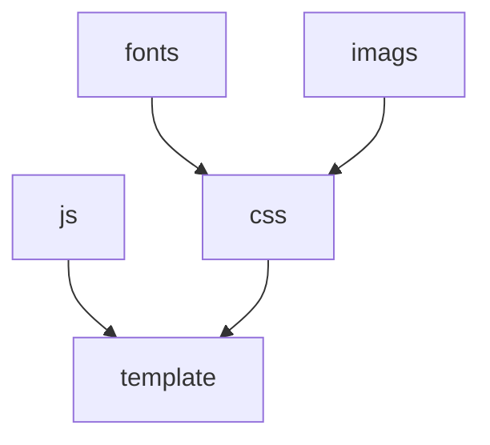

# 项目简介

用gulp自动化构建工具，实现前端代码的构建。

## 本项目完成的功能：

1. 文件指纹MD5命名，并自去替换文件中的路径防止客户端缓存;


2. js用browserify插件实现js的模块化，babel插件让我们一到 ES6语法的怀抱，.map文件调试、压缩代码等功能；
3. css样式引入postcss插件可以自动加浏览器前缀，用scss的语法写css （scss的功能很多，是最今最好的css预处理器之一，可能没有之一），小图标转base64等强大功能； 
4. 前后能能用的模板引擎，暂时定为mustache，并用mock.js造数据，方便开发；
5. 本地环境监听文件修改，自动刷新浏览器。

## 待完成功能

   1. **未能引入ESLint 插件**

      ESLint可以用来识别 ECMAScript 并且按照规则给出报告的代码检测工具，使用它可以避免低级错误和统一代码的风格。不符合代码统一风格的或有错误的js代码将不能git提交。但ESLint默认的配置太严格了，需要一条条看懂写出属于自己团体的配置文件，这样要花不少时间去试，所以暂时先不进行。

   2. **没有引入postcss-sprites或别的插件生成雪碧图**

      虽然已经用可以把小图标转base64的插件[`postcss-assets`](https://github.com/assetsjs/postcss-assets) 和fontIcon技术，所不是所有图标都适合转base64的。只有那些几KB的小图标才适合，不然css文件可以变大太。fontIcon虽然兼容很好，但只支持纯色的，彩色的fontIcon是用svg来做的旧浏览器会不兼容。

      当我们碰到那个十几KB 的小彩图时还是想做雪碧图的。

      引入[`postcss-sprites`](https://github.com/2createStudio/postcss-sprites) 可以做雪碧图，但可以会报错，虽然只是包的问题可以解决。但进行后怎么跟gulp-rev插件配合成想要的路径也是麻烦，暂时没有弄成功。

      **为什么不用compass 生成雪碧图？**

      曾几何时，sass+compass是前端人写页面的标配。compass做雪碧图无人能出其右。但它们都是ruby的产品，我们公司不用ruby只有来干点前端的事那是杀鸡用年刀。scss的语法我们已经用postcss的插件去实现了，但想用compass就必须装ruby。而且compass现在已经停止更新不再维护，不建议在项目中使用。

      **临时解决方案**

      使用线上的网站生成雪碧图，如：

      http://alloyteam.github.io/gopng/（腾讯的）

      https://www.toptal.com/developers/css/sprite-generator（国外的）

 3. **模板插件的选用**

      模板插件已选 用mustache，但它的功能比较少、gulp-mustache是个很冷门的插件、不支持一个模板一个js、json地造数据。所以可以要另外找其他模板来替换

      ​


# 安装

1. 去官网下载安装[node.js](https://nodejs.org)

2. 安装[cnpm](https://npm.taobao.org/) ，用淘宝镜像加快包的下载速度

   ```
    npm install -g cnpm --registry=https://registry.npm.taobao.org
   ```

安装完成后可以用 cnpm  来替换npm去装包了，如果你已翻墙，那就没必要用cnpm 了

3. 全局安装[gulp](http://www.gulpjs.com.cn/)和[browser-sync](http://www.browsersync.cn/) 

   ```
   npm -g gulp browser-sync
   ```
   网络不好可以用cnpm 代替
   ```
   cnpm -g gulp browser-sync
   ```

4. 进入项目跟目录（package.json文件所在目录），安装所以的包

   比如项目在目录在D:\gitSite\gulp-eelly中，可以鼠标右键选Git bash Here，如果没装git那用命令行进入。


```npm install
npm install
```

# 运行任务

| 任务名       | 作用                                    |
| --------- | ------------------------------------- |
| build     | 压缩js、css、图片、字体等文件到dist文件夹             |
| del-build | 先清空dist中的文件夹再运行build                  |
| server    | 运行build任务并启动一个本地服务，会监听文件变化，自动打开、刷新浏览器 |

运行任务命令

```
npm run build
```

> 运行任务命令不可以用cnpm 代替

## 可带参数过行任务

默认情况下运行任务是读取根目录下的build.config.js，但要加其他配置文件也是可以的如build.dev.config.js或自义一下build.lyk.config.js。运行任务时可以在后面加上参数就行，如：

```
npm run build -- --config=dev
```

如后就会用到build.dev.config.js配置文件，同理，想用build.lyk.config.js文件就可以运行

```
npm run build -- --config=lyk
```

## 配置文件

配置文件（buil.dev.config.js）的内容一般如下：

```
module.exports = {
    staticUrl: '//static.eelly.dev',
    uglifyConfig: {
        compress: true,
        ie8: true   
    },
    browserSyncConfig: {
        server: {
            baseDir: ['dist','dist/www'],
            index: 'dome.html'
        }, 
        port: 3030,     
        files: ['dist/**/*.html']
    }
}
```


| 参数           | 作用                                       |
| ------------ | ---------------------------------------- |
| staticUrl    | 静态文件网址                                   |
| uglifyConfig | js压缩插件[uglify](https://github.com/mishoo/UglifyJS2#minify-options)的配置 |
| browserSync  | [browser-sync](http://www.browsersync.cn/docs/options/) 插件的配置 |

关于uglify和browser-sync相关配置可以点击表格中的链接查看，内容太多就不写到文档里了，特别是browser-sync可以让我们开发方便很多

# 目录结构

```

├── package.json      #NPM配置文件
├── gulpfile.js         # gulp任务都写在这了
├── postcss.config.js   # postcss 插件的相关样式配置
├── build.config.js     # 生成环境的配置文件
├── build.dev.config.js # 本地环境的配置文件
├── /node_modules/   # 包的安装目录，不用git提交
├── /mock/           # 用mock.js创数据，存放的相关js，前端开发者可以共享，不用提交到线上去
├── /rev/            # 存放着文件进行指纹命名前后的关系的json文件，不用git提交
├── /dist/           # 项目输出目录
├── /src/            # 项目源码目录
└── 
```
# 代码处理流程


